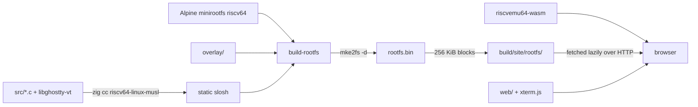

# webdemo

slosh in a browser tab: a riscv64 Linux, booted by Fabrice Bellard's TinyEMU
compiled to WebAssembly, with a root filesystem we build and slosh running as
the thing you land in. Nothing is installed, nothing is uploaded, and reloading
the page throws the machine away.

```sh
cd web/demo
make all        # download, cross-compile, build the filesystem, assemble the site
make serve      # http://localhost:8000
```

A bare `make` prints the target list, as it does at the top level.

`make serve` is a static file server. The output in `build/site` is *only*
static files, so anything that serves a directory will do -- including GitHub
Pages, S3, or `python3 -m http.server` -- with one condition: `.wasm` must be
served as `application/wasm` or the browser will not instantiate it. That is
the single thing our `serve` does that a default configuration might not.

It cannot be opened from `file://`: the emulator fetches the VM config and the
disk blocks with XMLHttpRequest.

## What you need

| | |
|---|---|
| zig 0.16 | `$HOME/zig-0.16.0/zig`, or `make ZIG=/path/to/zig` -- the same one the top-level build wants |
| e2fsprogs | `mke2fs`, `debugfs`, `dumpe2fs` -- all used unprivileged |
| curl | for `fetch-vendor` |
| gcc | only for `make check`, which builds the native emulator |

No npm, no bundler, no emscripten, and no root at any point.

## The targets

| | |
|---|---|
| `make vendor` | download the emulator, kernel, Alpine rootfs and xterm.js into `vendor/`, each pinned by sha256 |
| `make guest` | cross-compile slosh to a static riscv64 binary |
| `make rootfs` | build the guest filesystem and cut it into HTTP blocks |
| `make site` | assemble `build/site` |
| `make check` | boot the image in a native TinyEMU and check slosh comes up -- no browser |
| `make serve` | serve it (`PORT=8080` to move it) |
| `make clean` | remove `build/`; `distclean` also removes the downloads |

`./boot-check --interactive` boots the same image in your terminal and hands
you the keyboard, which is the fastest way to try a change to the overlay.
`C-a x` quits the emulator -- note that this is also slosh's leader key, so
type it twice if the session swallows the first.

## How it fits together



Four decisions are worth knowing about, because each one was a dead end
first.

**riscv64, not x86.** The x86 emulator in the JSLinux tarball is a prebuilt
blob with no source in TinyEMU's release -- `x86_cpu.c` there is a 96-line KVM
shim, not a software core -- and both its kernel and its userland are 32-bit
i386. riscv64 is the only target with published source, a 64-bit userland, and
a toolchain we already have: zig cross-compiles to `riscv64-linux-musl` out of
the box.

**A disk, not an initramfs.** The guest kernel is Bellard's prebuilt Linux
4.15, and it is built without `CONFIG_BLK_DEV_INITRD`: an `initrd:` line in the
VM config is accepted, ignored, and followed by a panic for want of a root.
The root filesystem is therefore an ext2 image on a virtio disk, split into
256 KiB files fetched over plain HTTP. `blk.txt` lists every block in its
`prefetch:` array, so the whole disk streams in at startup while boot
proceeds -- boot-critical blocks sit at the front, a demand read of a block
already in flight joins it, and once the stream ends the session never
touches the network again. A cold block fetched mid-keystroke reads as the
demo hanging, which is worse than the ~11 MiB the stream costs. An
initramfs would buy the same bytes-up-front without the overlap: nothing
boots until all of it has arrived.

Compression happens on the wire: the build writes a `.gz` twin beside every
block and every big asset, `serve` answers `Accept-Encoding: gzip` with the
twin and `Content-Encoding: gzip`, and XHR decodes before the emulator looks.
The emulator neither knows nor cares. Any competent static host or CDN does
the equivalent on its own.

**xterm.js, not the term.js in the tarball.** Bellard's terminal has no
truecolor and no wide-character handling. slosh paints 24-bit colour shaders
and lays out CJK, so that terminal would misrepresent both. The emulator
expects a global `term` with `write` and `getSize`; `web/demo.js` provides those
two methods over xterm.js and nothing else.

**Our emulator build, not Bellard's blob.** The prebuilt
`riscvemu64-wasm.js` in the JSLinux tarball does not match the source
released beside it: past 16 MiB into the disk it stops issuing block
fetches, so the first command to stat an inode in a later block group --
`ls -la`, typically -- wedges or segfaults in the guest. His demo images are
4 MiB, so upstream never crossed the line; our 32 MiB image did. The same
source compiled natively serves the same blocks flawlessly, so
`emulator/build-emulator` compiles the emulator from the tarball's own
source (ported to a current emscripten;
`emulator/patches/0001-modern-emscripten.patch` is the whole port) and the
result is committed in `emulator/dist/` -- because it needs the emscripten
SDK to rebuild, and nothing else here does. It is also half the size of the
blob it replaces.

## The guest

Alpine's riscv64 minirootfs -- musl, busybox, `apk`, `less`, `top` -- plus a
real vim with syntax highlighting (the `vim` package from pinned `.apk`s, its
26 MiB runtime pruned to the ~10 that highlighting uses: `syntax/`, filetype
detection, colour schemes; no docs, no spell, no netrw), plus `overlay/`,
which is the whole of what makes it ours:

| | |
|---|---|
| `etc/inittab` | four lines: run `rcS`, then respawn slosh on the console |
| `etc/init.d/rcS` | mounts, and `devpts` in particular: no devpts, no panes |
| `etc/profile` | the environment every pane inherits, `COLORTERM` included |
| `etc/motd` | five lines, shown in a pane rather than on the console |
| `root/.config/slosh/config.kdl` | the demo's config: the `sl0p` theme |
| `root/.vimrc` | syntax on, truecolor, and nothing that wants the pruned parts |
| `root/demo.layout` | the three panes you land in |

The theme is a symlink to `contrib/themes/sl0p.kdl`, so the demo cannot drift
from the palette the repository ships; `build-rootfs` copies it by content,
because a symlink in the image would dangle.

Editing anything in `overlay/` and running `make` rebuilds the image. There is
no state to clear: the emulator's writes live in the browser's memory and die
with the tab.

## Known limits

- **The terminal size is fixed at boot.** TinyEMU sends the console size once,
  from `console_init()`, and exports no way to send another. The page therefore
  measures the viewport once, tells the guest, and afterwards scales the fixed
  grid with a CSS transform instead of reflowing it. `?cols=`/`?rows=` override
  the choice.
- **No network.** There is no `eth0` in the VM config, so `apk add` cannot
  reach a repository. Everything in the demo has to be in the image.
- **Terminfo is an alias.** The image's only terminfo entries are ncurses'
  base set, with `xterm-ghostty` (the `TERM` slosh sets in panes, src/pty.c)
  symlinked to `xterm-256color` -- the honest subset. Truecolor still happens:
  `COLORTERM=truecolor` is exported and vim's `termguicolors` is on.
- **It is an emulator.** A keystroke costs an interpreted instruction stream;
  the session is responsive but the machine is not fast, and a `make` inside it
  would take a while.

## Provenance

Nothing in `vendor/` is committed. `fetch-vendor` downloads each piece and
checks it against a sha256 recorded in the script, tarball and extracted member
both:

- TinyEMU / JSLinux -- BIOS, kernel, and the emulator *source*. MIT, Fabrice
  Bellard, <https://bellard.org/tinyemu/>. The licence text is copied into
  `build/site` next to what it covers.
- Alpine Linux riscv64 minirootfs, <https://alpinelinux.org>.
- xterm.js 5.5.0, MIT.

The one binary this directory commits is `emulator/dist/riscvemu64-wasm.{js,wasm}`
-- MIT, built from the pinned TinyEMU tarball by `emulator/build-emulator`,
reproducible from the patch beside it. The kernel and the Alpine userland are
GPL binaries; a repository that shipped those would owe their source, so we
point at their publishers instead.
